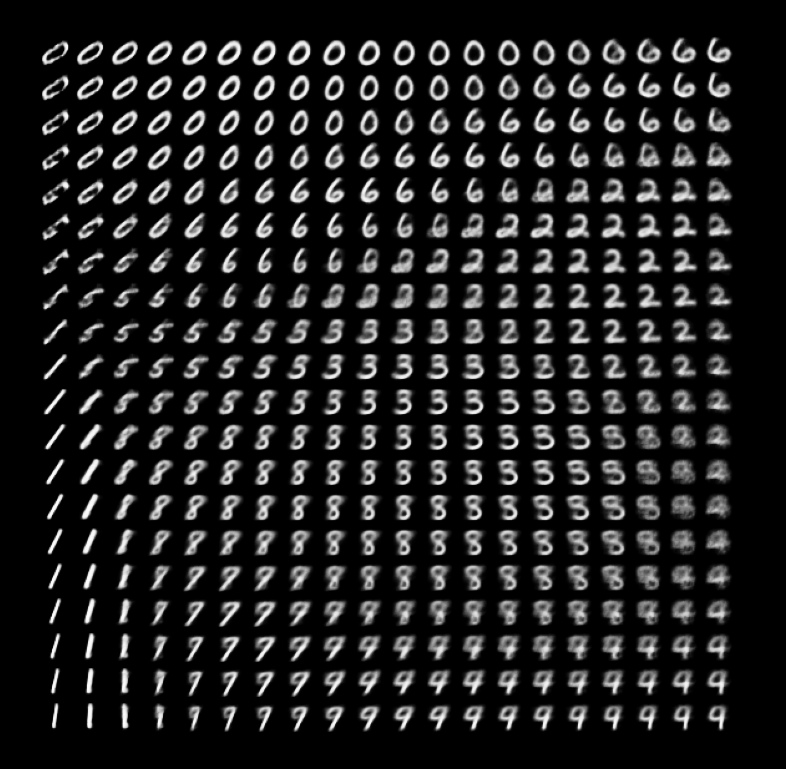

# VAE

Personal implementation of convolutional variational auto-encodeur in many frameworks.

To install the requirements, run in a new virtual environment:

```script
pip install -r <framework>/requirements.txt
```

To run a training (example in tensorflow):

```script
python3 <framework>/train.py
```

The configurations can be changed in the script.

Example of images generated by a VAE on hand-written digits MNIST (with latent dimension of 2) from a grid on latent space:


